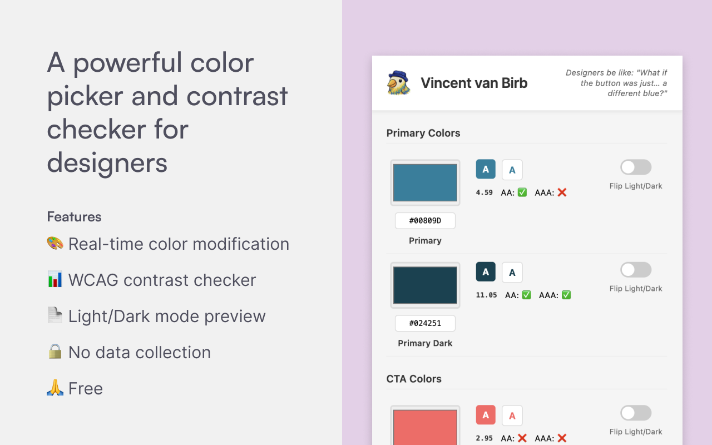

# Vincent van Birb 🎨

*Designers be like: "What if the button was just… a different blue?"*



A Chrome extension for modifying website colors and checking contrast ratios in real-time.

## Features

- Color picker with real-time preview
- WCAG contrast checker
- Light/Dark mode toggle
- Save and reset colors

## Installation

1. (pending approval) ~~Download the extension from the Chrome Web Store~~
2. Or install manually:
   - Clone this repo
   - Go to `chrome://extensions/`
   - Enable "Developer mode"
   - Click "Load unpacked" and select the `vincent-van-birb` directory

## Usage

1. Click the extension icon to open the color picker
2. Select colors using the color picker or hex input
3. Check contrast ratios and WCAG compliance
4. Use "Apply Colors" to save changes
5. Use "Revert colors" to reset

## Development

```bash
# Build extension
zip -r vincent-van-birb.zip manifest.json popup.html popup.js content.js icon16.png icon48.png icon128.png
```

## License

MIT
